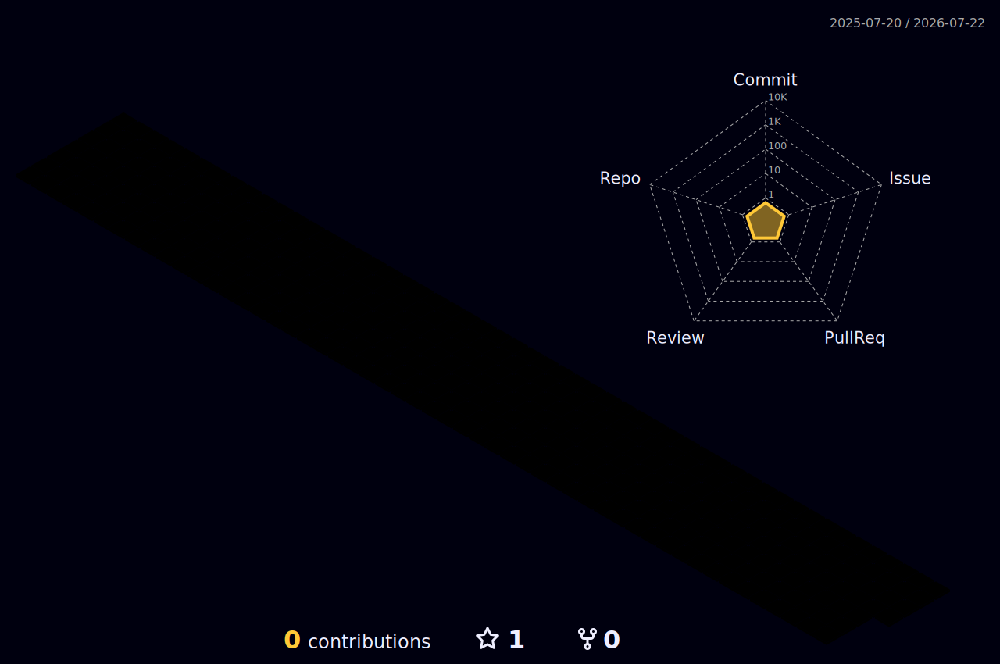

<!-- ┌─────────────────────────────────────────────────────────────┐ -->
<!-- │   ChristLZS · 李之胜 · GitHub Profile                        │ -->
<!-- │   Theme: Cyber Neon Purple 🟣                                │ -->
<!-- └─────────────────────────────────────────────────────────────┘ -->

<!-- ====================  顶部霓虹横幅  ==================== -->
<a href="https://github.com/ChristLZS">
  
</a>

<!-- ====================  打字机动画  ==================== -->
<p align="center">
  <a href="https://github.com/ChristLZS">
    
  </a>
</p>

<!-- ====================  徽章条  ==================== -->
<p align="center">
  
  <a href="https://github.com/ChristLZS?tab=followers">
    
  </a>
  
  
</p>

<!-- 彩虹流光分隔线 -->


## 🧑‍💻 About Me


```python
class ChristLZS:
    def __init__(self):
        self.name        = "李之胜 (Jerry)"
        self.role        = "Full-Stack Developer & ML Enthusiast"
        self.languages   = ["Python", "Go", "Rust", "TypeScript", "C++"]
        self.stack       = ["Vue", "Django", "Go-Frame", "PyTorch", "MySQL"]
        self.focus       = "把有趣的想法变成能跑的代码 🚀"
        self.fun_fact    = "做过 Live2D 桌宠、贪吃蛇、徒步路书，杂食程序员一枚"

    def say_hi(self):
        print("Thanks for dropping by! Let's build something cool together 🟣")
```

<br clear="both" />

<!-- 彩虹流光分隔线 -->


## 🛠️ Tech Stack

<p align="center">
  
</p>

<!-- 彩虹流光分隔线 -->


## 📊 GitHub Stats

<p align="center">
  
  
</p>

<p align="center">
  
</p>

<!-- ====================  贡献活跃度曲线  ==================== -->
<p align="center">
  
</p>

<!-- 彩虹流光分隔线 -->


## 🧊 3D Contribution Skyline

<!-- 由 GitHub Action 自动生成（profile-3d-contrib.yml） -->
<p align="center">
  
</p>

## 🐍 Contribution Snake

<!-- 由 GitHub Action 自动生成（snake.yml），蛇会吃掉贡献格子 -->
<p align="center">
  
</p>

<!-- 彩虹流光分隔线 -->


## 🏆 Trophies

<p align="center">
  
</p>

<!-- 彩虹流光分隔线 -->


## 🌟 Featured Projects

| 项目 | 简介 | 技术 |
|------|------|------|
| 🐾 [live2d-claude-pet](https://github.com/ChristLZS/live2d-claude-pet) | Live2D 桌宠，Claude Code 完成任务时弹通知 | `JavaScript` |
| 🎛️ [copilot-hud](https://github.com/ChristLZS/copilot-hud) | GitHub Copilot CLI 的可配置状态栏 | `TypeScript` |
| 🛡️ [ClipboardGuard](https://github.com/ChristLZS/ClipboardGuard) | macOS 上拦截微信输入法语音自动复制 | `Objective-C` |
| 🥾 [trail-atlas](https://github.com/ChristLZS/trail-atlas) | 山野路书 · 国内经典徒步路线攻略 | `HTML` |
| ⚙️ [gfast](https://github.com/ChristLZS/gfast) | 基于 Go-Frame 的后台管理系统 | `Go` `Vue` |

<!-- 彩虹流光分隔线 -->


## 📫 Connect with Me

<p align="center">
  <a href="mailto:mr.lizhisheng@gmail.com">
    
  </a>
  <a href="https://github.com/ChristLZS">
    
  </a>
</p>

<!-- ====================  底部霓虹横幅  ==================== -->

